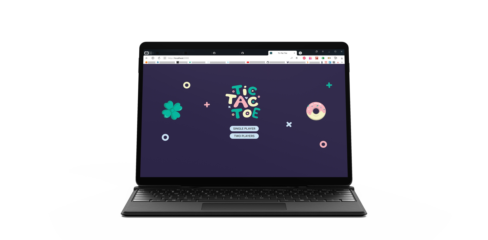
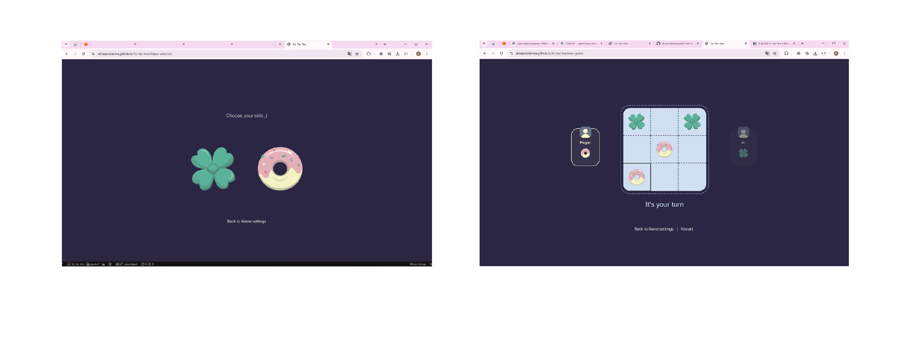

# Tic-Tac-Toe

A modern implementation of the classic Tic-Tac-Toe game built with React. The project features a single-player mode powered by the Minimax algorithm, a two-player mode, responsive UI, and smooth game interactions.

#### Live Demo: https://alinazolotavina.github.io/tic-tac-toe/

## Preview

### Home screen



### Shape selection & gameplay



## Features

- Single-player mode against AI
- Two-player local mode
- AI powered by the Minimax algorithm
- Animated winning celebration
- Responsive layout
- Accessible controls
- Restart game at any time

## Tech Stack

- React
- React Router
- Vite
- JavaScript (ES6+)
- CSS

## AI

The computer opponent uses the **Minimax** algorithm.

For every available move, the algorithm recursively evaluates all possible future game states and chooses the move with the highest score. As a result, the AI always makes the optimal move and cannot be defeated if both players play perfectly.

## Getting Started

Clone the repository:

```bash
git clone https://github.com/AlinaZolotavina/tic-tac-toe.git
```

Install dependencies:

```bash
npm install
```

Run the development server:

```bash
npm run dev
```

Open:

```
http://localhost:5174/tic-tac-toe/
```

## Build

Create a production build:

```bash
npm run build
```

Preview the production build locally:

```bash
npm run preview
```

## Project Structure

```
src/
|-- assets/
|-- blocks/
|-- components/
|-- utils/
`-- main.jsx
```

## Design

The visual style of this project was inspired by the ["TicTacToe Mini Game"](https://www.behance.net/gallery/85650953/TicTacToe-Mini-Game) concept by [Iliana Dimitrova](https://www.behance.net/ilianastavreva).

All icons and illustrations were created by me in Adobe Illustrator, using the original concept as a visual reference.

The complete UI design for this project is available on [Behance](https://www.behance.net/gallery/245794601/Tic-Tac-Toe-UI-design).

CSS animations are used throughout the project to make the gameplay feel more lively and engaging.

## Future Improvements

- Support multiple AI difficulty levels
- Add internationalization

## License

This project is available under the MIT License.
